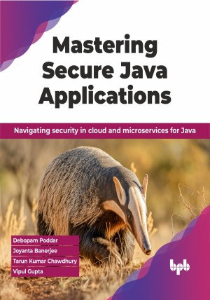

# Mastering Secure Java Applications

Elevate your Java security skills for the modern cloud era

This is the repository for [Mastering Secure Java Applications
](https://bpbonline.com/products/mastering-secure-java-applications?variant=43280868114632),published by BPB Publications.

## About the Book
This book offers a comprehensive guide to implementing Zero-Trust security principles, cloud-based defenses, and robust application development practices. Through practical examples and expert advice, readers will gain the skills needed to design and develop secure Java applications that easily can tackle today's cyber threats.

It builds focus on securing your source code through analysis, vulnerability detection, and automation. It also ensures the safety of your runtime environment for managing traffic and enables multi-factor authentication. While addressing data security concerns with encryption, anonymization, and cloud-based solutions, it also uses tools like OpenTelemetry for real-time threat detection. It manages sensitive information securely with Vault integration and explores passwordless authentication. Reference architectures, secure coding patterns, and automation practices are also provided to aid implementation. 

By the end of this book, you'll be well-equipped to build secure Java applications with confidence and deliver applications that are robust, reliable, and compliant.

## What You Will Learn
• Implement Zero-Trust principles in Java applications.

• Secure Java apps in cloud environments like AWS, GCP, and Azure.

• Develop applications with security best practices from the ground up.

• Understand and mitigate common security vulnerabilities in Java.

• Apply modern security tools and techniques in Java development. 
